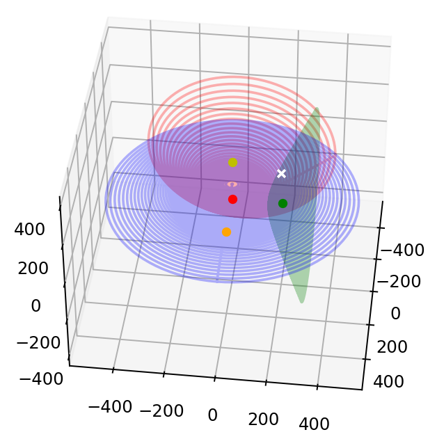

# Localisation Audio3D

## Overview
To start using the project just do :

    pip install -r .\requirements.txt

You can use "Exemple3D.py" to test the program, just change the coordinates of the fake bee and the fakes mics and it will create audios that correspond to what the mics would have recorded
    
    x_bee= 30
    y_bee= -400
    z_bee= 500
    
    mic0=Mic(0,0,0)
    mic1=Mic(300,0,0)
    mic2=Mic(0,300,0)
    mic3=Mic(0,0,300)

If you want to add noise to the audios, just uncomment all this lines :
    
    #audio0=at.add_noise_to_audio(audio0,30)

The cross-corelation will do his magic and the result will be ploted, the bee is where the 3 graphs intersect

The accuracy is around few centimeters, but it depends on the noise and the distance between the mics

Here is an example of the result :

the white cross is where the bee is in reality and the black cross (not in the screenshot) is where the program thinks the bee is

To better understand the math behind the graphs : https://www.geogebra.org/calculator/dsefftru \
By using "Exemple2D.py" you will better understand how the program works

## What to do next?
For now the coordinates are only approximated, so it would be a good thing to find a way to get the exact coordinates of the bee using math \
The cross-corelation algorithm works quite well, but it needs to be tested in real life.

## The maths :

### 2D
the plots in exemple2D are ploted using this formula :

$$x=x_{mid} \pm \frac {h(y_2-y_1)} d$$
$$y=y_{mid} \pm \frac {h(x_2-x_1)} d$$

with :
* $d=\sqrt {(x_2-x_1)^2+(y_2-y_1)^2}$
* $a= \frac {r_1^2 -r_2^2 +d^2} {2d}$
* $x_{mid} = x_1+ \frac a d \times (x_2-x_1)$
* $y_{mid} = y_1+ \frac a d \times (y_2-y_1)$
* $h=\sqrt {r_1^2-a^2}$

$d$ is the distance between mic0 and the bee, so python will try a lots of values for $d$ and will plot the result.

### 3D
I created the class `Circle` that defines a 3D circle with a specified center, radius, and normal vector. The purpose of the `draw` method is to generate points on this 3D circle so that it can be visualized.

Let's break down the math involved in this process step by step:

#### 1. Orthonormal Basis Construction

The first step involves constructing an orthonormal basis with the normal vector as the z-axis. This basis is used to properly orient the circle in 3D space.

Let $\mathbf{n}$ be the given normal vector, which is normalized to a unit vector $\mathbf{z}$. We then calculate two orthogonal vectors $\mathbf{x}$ and $\mathbf{y}$ that lie in the plane of the circle.

$$
\mathbf{z} = \frac{\mathbf{n}}{\|\mathbf{n}\|}, \quad \mathbf{x} = \begin{cases}
\begin{array}{l}
\mathbf{n} \times \begin{bmatrix} 1 \\ 0 \\ 0 \end{bmatrix}, \quad \text{if} \; \mathbf{n} \approx \begin{bmatrix} 1 \\ 0 \\ 0 \end{bmatrix} \\
\mathbf{n} \times \begin{bmatrix} 0 \\ 1 \\ 0 \end{bmatrix}, \quad \text{otherwise}
\end{array}
\end{cases}, \quad \mathbf{y} = \mathbf{z} \times \mathbf{x}
$$

#### 2. Parametric Equation of a Flat Circle

Next, points are generated on a flat circle using the parametric equations of a circle in 2D space:

$$
x = r \cos(t), \quad y = r \sin(t)
$$

where $r$ is the radius of the circle and $t$ varies from $0$ to $2\pi$.

#### 3. Rotation and Translation

The generated 2D points are then rotated to account for the orientation of the circle in 3D space. This is done by transforming the points using the constructed orthonormal basis:

$$
\mathbf{p}_{\text{rotated}} = \mathbf{p}_{\text{flat}} \cdot \begin{bmatrix} \mathbf{x} \\ \mathbf{y} \\ \mathbf{z} \end{bmatrix}
$$

where $\mathbf{p}_{\text{flat}}$ are the 2D points and $\mathbf{p}_{\text{rotated}}$ are the rotated 3D points.

Finally, the rotated points are translated by adding the center of the circle:

$$
\mathbf{p}_{\text{translated}} = \mathbf{p}_{\text{rotated}} + \mathbf{c}
$$

where $\mathbf{c}$ is the center of the circle.

#### Conclusion
I'm using the same kind of algorithm as in 2D, but in 3D, and i'm using the this class to transform the 2D plot into 3D
